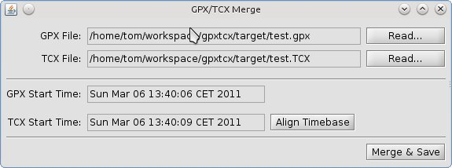

= Gpx/Tcx Merge
Thomas Kern
:idprefix:
:idseparator: -
:experimental:

This is a little utility to merge the output of a Garmin heart rate monitor (+.tcx+ file)
with a file generated by a GPS logger (Wintec? +.gpx+ file). The merged file is an enhanced
GPX file with additional heart rate information added as `TrackPointExtension` for each track point.

I wrote this program for a friend who was carrying two separate devices during
his training and wanted to combine the data into a single GPX file.

It works well for him and for the devices he is using, but I do not know
if there is a general purpose for this program. I wrote this several
years ago and do not really have a huge interest in it.
However, instead of having it just lying around on my local disk, it
just found a new home on GitHub!

== Installation

To run the program you need to have at least a Java Runtime Environment >= 6 installed on your computer.

=== Installing and Running the Pre-packaged Program

* Clone this repository with git or download the zip file by pressing the `Download ZIP` button on the GitHub page.
* In case you downloaded the ZIP file, extract the contents to a local directory of your choice.
* Inside directory `target`, you'll find the following two files:
+
----
gpxtcx-1.0-SNAPSHOT.tar.gz
gpxtcx-1.0-SNAPSHOT.zip
----
+
Pick the one which fits your platform best and extract the content to a final installation directory.
* On Linux, make file `gpxtcx` executable:
+
----
chmod 755 gpxtcx
----
+
and start the program:
+
----
./gpxtcx
----
* On Windows, just double-click `gpxtcx.cmd`.

Directory `testdata` contains a GPX and a TCX file as an example
which may be used to create a merged GPX.

After reading each of the files, the GPX and the TCX start times will be displayed.

Under the
assumption, that logging and heart rate monitor were both started at about the same time,
there will still be a slight difference in the time bases because the time of
the heart rate monitor may not be correct. (The time of the GPS logger will always be correct,
because it retrieves the current time from the GPS signal.)

Using the `Align Timebase` button aligns the time of the heart rate monitor with the
time of the GPS logger. The offset is considered when merging the two files.

Pressing `Merge & Save` lets you choose and create a merged GPX output file.

=== Build from Sources

If you want to build from sources, you need to have a JDK >= 6 and Maven installed and configured.

Form inside   the top level directory of the source distribution, invoke
----
mvn install
----
from the commandline to compile the sources and `.zip` and `.tar.gz` in the target directory.

To run your compiled program, you may directly execute `gpxtcx` or `gpxtcx.cmd` from the target
directory.

== Credits

This software uses http://www.jgoodies.com/freeware/libraries/forms/[JGoodies Forms]
and http://www.jgoodies.com/freeware/libraries/looks/[JGoodies Looks].

== Copyright and License

Copyright (C) 2011-2015 Thomas Kern

Licensed under MIT License.
See https://raw.githubusercontent.com/nerk/gpxtcx/master/LICENSE.txt[LICENSE] for details.

JGoodies Forms and JGoodies Looks Copyright
by http://www.jgoodies.com[JGoodies Software GmbH].
Licensed under http://opensource.org/licenses/bsd-license.html[BSD Open Source License].

